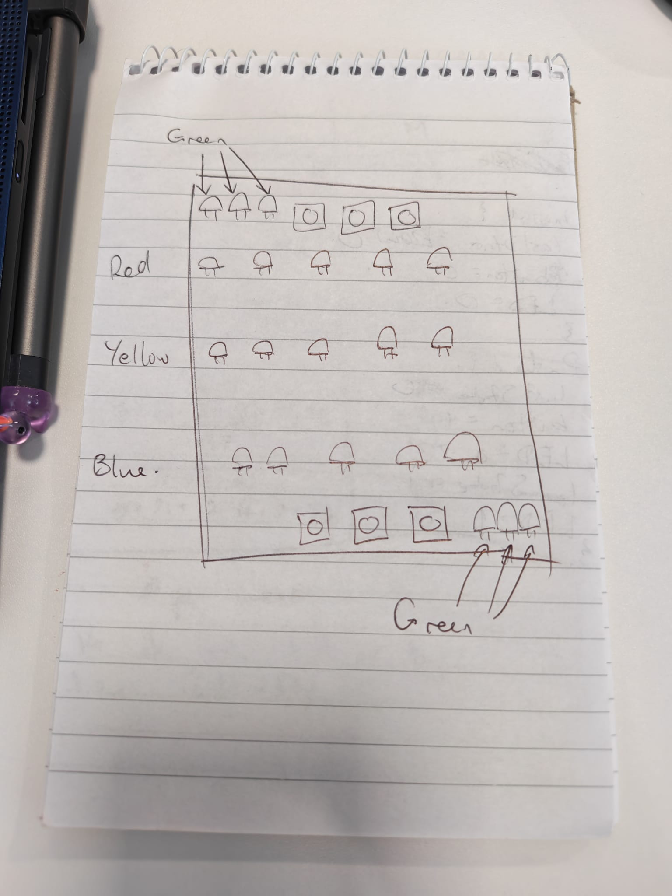

# Summer-Project-2026
## Divergent thinking
### Idea 1, e-ink planner:

- Possible to have some minigames with buttons on the side
- Need to figure out the form factor for typing
    - Pull out keyboard?
    - Magnetic wireless keyboard?
    - Pen?
- Maybe a little compartment for pieces of paper in case you want to sketch something
- [Possible display](https://www.aliexpress.com/item/1005009712001279.html?spm=a2g0o.detail.pcDetailBottomMoreOtherSeller.5.27f1lMwflMwfpN&gps-id=pcDetailBottomMoreOtherSeller&scm=1007.40050.354490.0&scm_id=1007.40050.354490.0&scm-url=1007.40050.354490.0&pvid=f8932bdc-10cd-4720-824a-765b6bdad1d0&_t=gps-id%3ApcDetailBottomMoreOtherSeller%2Cscm-url%3A1007.40050.354490.0%2Cpvid%3Af8932bdc-10cd-4720-824a-765b6bdad1d0%2Ctpp_buckets%3A668%232846%238116%232002&pdp_ext_f=%7B%22order%22%3A%22501%22%2C%22eval%22%3A%221%22%2C%22sceneId%22%3A%2230050%22%2C%22fromPage%22%3A%22recommend%22%7D&pdp_npi=6%40dis%21GBP%2113.68%2110.60%21%21%21122.68%2195.07%21%40211b80f717772799564108492e2c58%2112000049926703178%21rec%21UK%217590588945%21XZ%211%210%21n_tag%3A-29911%3Bd%3A2a5ed4e6%3Bm03_new_user%3A-29895%3BpisId%3A5000000203680005&utparam-url=scene%3ApcDetailBottomMoreOtherSeller%7Cquery_from%3A%7Cx_object_id%3A1005009712001279%7C_p_origin_prod%3A)

### Idea 2, cyberdeck:
- Lots of versatility but may be too complex or expensive

### Idea 3, extend functionality of my radio, give it a timer on the screen, games, link it with calendar, etc.
- Similar to Amazon Echo or Google Home

### Idea 4, MP3 player
- Could be a fun little project
- Might be too easy
- A good starting place for someone inexperienced
- Lots of opportunity to extend functionality, give it Wi-Fi etc.
- Could add buttons for a tactile experience
- Could have it link to another device via Bluetooth to show what's playing and provide controls for it
    - Rather than having it be its own MP3 player
- Local storage too
- Could even have journal functionality on this, link with an app
- 2 form factor options:
    - Old iPod:
    
    - Full screen:
    

### Idea 5, carplay but for a desk
- Similar to the MP3 player idea but not portable
- Not really a good idea because I could just make a stand for the MP3 player that can "convert" it to this

### Decision time
I'm going with the MP3 idea because it's something simple to start with, but it has a lot of potential to be extended and innovated. Namely with the journal functionality and Wi-Fi. There are also a lot of design decisions which I'm going to have to justify which will be good practice.

***

## Convergent thinking
I've already done a bit of this inadvertently in the divergent thinking section, looking at different form factors for the device so let's begin by looking at those again.

### Old iPod

- Boxy looking screen at the top
- Pause/unpause button in the centre below the screen
- Skip backwards track is to the left of the pause/unpause button
- Skip forwards track is to the right of the pause/unpause button
- Power on and volume buttons would be on the side of the device
- Benefits:
    - Clear buttons for everything
- Drawbacks:
    - More buttons than necessary
    - Could use something similar to the Motorola gesture where you can skip tracks by holding pressed down on the volume buttons which eliminates the need for 2 of the front buttons
    - Small screeen

### Full-screen

- No buttons on the same face as the screen
- No designated skip track buttons, just hold pressed on the volume buttons to skip track
- Likely haptic feedback to tell you when you've skipped
- Buttons on the side of the device:
    - Volume up (also skip forward track)
    - Pause
    - Volume down (also skip backward track)
- Power button will likely be on the top of the device to not get confused with the rest of the buttons
- Power button could just be a secondary functionality of the pause button, e.g. hold the pause button to power off, but that seems tacky
- Benefits:
    - More of a tactile feel when skipping tracks or pausing
    - Has a nice casette player vibe
    - Haptic feedback when skipping tracks is satisfying
    - Less buttons so it's a simpler, more elegant design
    - Big screen
- Drawbacks:
    - Less buttons means less functionality can be added in the future

### Stick

- Similar to the full screen prototype but the device is a lot more narrow
- Might not actually have the screen be the whole length of the device if things don't fit nicely
- Benefits:
    - Even more portable
    - Very tactile, can easily be held with no risk of dropping
    - Would be nice for running
- Drawbacks:
    - Smaller screen
    - Less opportunity for adding features in the future due to the smaller screen, would have to find workarounds like a landscape mode

### Decision time
At the moment I can't think of any other viable ideas. I think the iPod form factor is a clear loser, having more buttons than necessary is quite silly and having used a Motorola in the past, what I miss the most about it is the ability to hold pressed on the volume buttons to skip tracks so this would be a nice homage to that. Additionally, the smaller screen on the iPod form factor is uncessary, if the buttons below it are unnecessary, either there should be no space below the screen, or there should be a bigger screen so that it takes up the whole body.

Deciding between the stick and the full-screen options, it's really quite difficult. As the designer of this, I think that it would be quite elegant to have the slim, stick form factor as it doesn't use more space than is necessary. Although, it could be nice to have the larger screen of the full-screen prototype so that there's a lot of space for adding extra functionality. Overall, I will attempt to take the stick prototype further since it has the added factor that it's quite unique and cool, but if I can't fit all of the components inside of that form factor, I'll be forced to go with the full-screen prototype. I won't really look at buying a screen until I've decided on all of the internal components and worked out what features I want to have, and then analysed whether I need the larger screen or if the smaller form factor will suffice.

***

## Deciding on components
For this part, I'm going to be experimenting with different boards on [Wokwi](https://wokwi.com/), the simulations will be found in ./simulations

After messing around with Wokwi, I've decided to experiment with an ESP32-S2 board (linked [here](https://www.aliexpress.com/item/1005009711874009.html?spm=a2g0o.order_list.order_list_main.5.2b641802aIwZAe)) and a breadboard kit (linked [here](https://www.aliexpress.com/item/1005006152882281.html?spm=a2g0o.order_list.order_list_main.17.2b641802aIwZAe)) from AliExpress. I was trying to create a pushbutton-activated LED circuit using the ESP32 simulation on Wokwi but nothing that I tried worked although my code looks right to me. I decided to purchase a cheap ESP32 board and breadboard kit so that I can't blame the simulation software for not working anymore, my last attempt at making it work is in ./esp32-s2/src/main.cpp.

I've managed to make a basic program that will switch an LED on and off (./testPrograms/ledOnOff.ino). My next goal is to make a program that works with an RGB LED to make it change colour. This will be done in ./testPrograms/rgbLed.ino.

The program doesn't work for the RGB LED that came with the kit, however it does work if I connect a red LED to pin 2, green to pin 3, and blue to pin 4. I believe it's either because the RGB LED is faulty or due to the fact that I can't tell if it's common anode or common cathode. I'm going to try for BlueTooth connectivity now.

It turns out that the board I ordered doesn't have Bluetooth connectivity, only WiFi connectivity. So I can't use it for the project that I want. However, that's no reason that I can't still use it for something. I will make a small shooting game using some LEDs and 3 buttons.

***

## Change of plan!!

The game will look like this:

As you can see, I will need 6 buttons, 6 green LEDS, 5 red LEDs, 5 yellow LEDs, and 5 blue LEDs. All of which came with the breadboard kit that I previously ordered.

The middle button will be the button for shooting. For example, if the blue player is in the middle and presses the middle button, the middle yellow LED will light up, and if the red player is standing in the middle as well, they will lose a life - represented by the green LEDs in the red end. The other two buttons will be used for moving left and right.

This game will be in ./testPrograms/shootingGame.ino

At this point I think my game is done, however I don't have enough female to male connectors to fully test it so I'll have to wait to get my hands on some more of those before being able to say for sure that it's done. I'm also not sure if the delay that I've put for shooting will block the players from moving, again it's something that I'll test when I have more connectors. Although if it does block player movement, I've been researching asynchronicity in c++ and Arduino. I found [this article](https://medium.com/@m.valizadeh/async-programming-in-arduino-unleashing-the-power-of-non-blocking-code-45205a691938) which may be of use.

I started looking at using WiFi on the ESP32 that I originally bought too, however I can't seem to figure out how to create a webpage would be able to run anything resembling a game or something interesting to interact with because it seems like the only way to send that webpage data to a client is by printing lines of HTML to each NetworkClient.

I've now ordered a [new ESP32](https://www.aliexpress.com/item/1005010676427148.html?spm=a2g0o.order_list.order_list_main.10.44901802PRF54w), this time the C3 SuperMini variant as I've double checked that it has both WiFi and Bluetooth capabilities and it's very small, as required by my project. Along with that, I've also ordered a [1.8 inch display module](https://www.aliexpress.com/item/1005012439751456.html?spm=a2g0o.order_list.order_list_main.5.44901802PRF54w). I saw someone that has similar requirements to my project with also a similar screen and the ESP32 C3 SuperMini, so I'm hoping [their question](https://forum.arduino.cc/t/how-to-connect-st7789-display-to-esp32-c3-supermini/1298551) on the Arduino forum will be able to help me with my project as well. A Redditor also asked a [similar question](https://www.reddit.com/r/esp32/comments/1l130hk/esp32_c3_supermini_ga9a01_display_128_240x240/) on r/esp32 which may be of help when connecting the display as well. Some more female to male connectors have also been ordered so that I can finish off testing the game that I made on the ESP32-S2.

The display is estimated to arrive on the 2nd July and the ESP32 C3 SuperMini is estimated to arrive on the 6th July

I've been spending some time trying to figure out the wiring that I'll need to do for the display and ESP32, I think I've finally got it figured out:

Cleaner diagram below:

Hopefully this works, I went through a few YouTube videos and many obscure forum posts for this, I also found [a video](https://www.youtube.com/watch?v=A0fm15ydH4o) that will help me learn to use the display once it arrives as well. Still waiting on both the chip and display to be delivered.

Both have been delivered! I've tested the screen and the new ESP32 and both work perfectly, I'm taking a look at libraries that I could use to control media on my phone and I think I've found a promising one [here](https://github.com/T-vK/ESP32-BLE-Keyboard). I'm going to test it out now!

I had a small issue with this library but it was fixed using [this thread](https://github.com/T-vK/ESP32-BLE-Keyboard/issues/313). Now everything works smoothly.

The BLE Keyboard library was a flop, trying to send media key presses to any device would cause a seg fault in the ESP32. I have a theory this may be because the device has so little memory since it doesn't seem to be able to send strings longer than 7 characters via bluetooth using that library either. So I'm going to try to proceed with [EDP-IDF](https://github.com/espressif/esp-idf/tree/master), which is the Expressif IoT Development Framework. This may be more difficult to code as it seems to be lower-level, however I don't wish to order any more ESP's, I'm already 2 in...

I'm havin difficulty finding the OpenOCD file for the ESP32 C3 SuperMini so I'm going to read over the Bluetooth examples in Arduino IDE and try to make sense of them, that may allow me to send media control signals to devices.

In trying to figure out how ArduinoBLE works, I took some notes and then wanted to try to create a program that will just connect my ESP32 to a device and print to serial that it worked. So I had to install the ArduinoBLE library, when doing this, I also took a look at any library that came up when I searched "ble". I found a library that I have now tested pausing media with, and it works perfectly! [Hijel_BLEKeyboard](https://github.com/HijelHub/HijelHID_BLEKeyboard). I no longer need to work with ArduinoBLE, however it was interesting to find out some things about it.